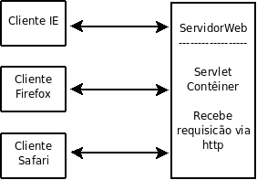
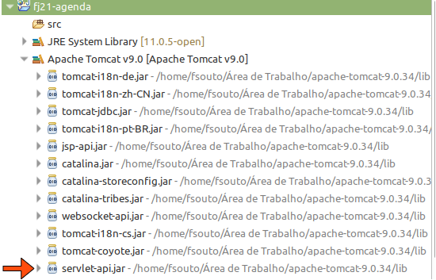
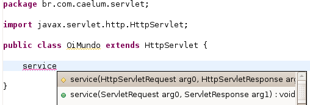
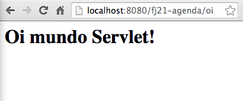
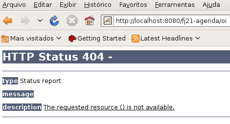
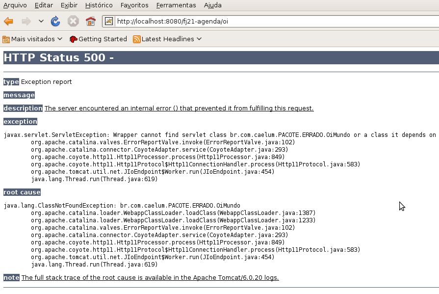
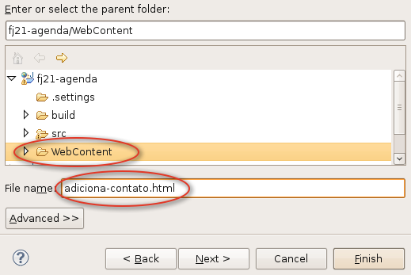
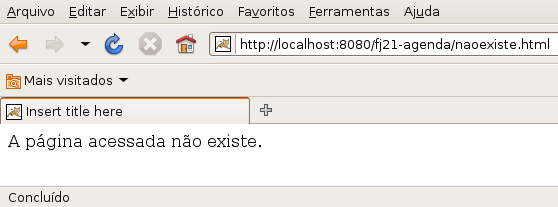

# Servlets
_"Vivemos todos sob o mesmo céu, mas nem todos temos o mesmo horizonte." -- Konrad Adenauer_

Ao término desse capítulo, você será capaz de:

* fazer com que uma classe seja acessível via navegador;
* criar páginas contendo formulários;
* receber e converter parâmetros enviados por uma página;
* distinguir os métodos HTTP;
* executar suas lógicas e regras de negócio.


## Páginas dinâmicas

Quando a Web surgiu, seu objetivo era a troca de conteúdos através, principalmente, de páginas HTML
estáticas. Eram arquivos escritos no formato HTML e disponibilizados em servidores para serem acessados
nos navegadores. Imagens, animações e outros conteúdos também eram disponibilizados.

Mas logo se viu que a Web tinha um enorme potencial de comunicação e interação além da exibição de
simples conteúdos. Para atingir esse novo objetivo, porém, páginas estáticas não seriam suficientes.
Era preciso servir páginas HTML geradas dinamicamente baseadas nas requisições dos usuários.

Hoje, boa parte do que se acessa na Web (portais, blogs, home bankings etc) é baseado em conteúdo
dinâmico. O usuário requisita algo ao servidor que, por sua vez, processa essa requisição e devolve
uma resposta nova para o usuário.

Uma das primeiras ideias para esses "geradores dinâmicos" de páginas HTML foi fazer o servidor Web
invocar um outro programa externo em cada requisição para gerar o HTML de resposta. Era o famoso
**CGI** que permitia escrever pequenos programas para apresentar páginas dinâmicas usando, por exemplo,
Perl, PHP, ASP e até C ou C++.

Na plataforma Java, a primeira e principal tecnologia capaz de gerar páginas dinâmicas são as **Servlets**,
que surgiram no ano de 1997. Hoje, a versão mais encontrada no mercado é baseada nas versões 2.x,
mais especificamente a 2.4 (parte do J2EE 1.4) e a 2.5 (parte do Java EE 5). A última versão disponível
é a versão 3.0 lançada em Dezembro de 2009 com o Java EE 6, e que vem sendo gradativamente adotada
no mercado.

## Servlets


As **Servlets** são  a primeira forma que veremos de  criar páginas dinâmicas com Java. Usaremos
a própria linguagem Java para isso, criando uma classe que terá capacidade de gerar conteúdo HTML.
O nome "servlet" vem da ideia de um pequeno servidor (_servidorzinho_, em inglês) cujo objetivo é
receber chamadas HTTP, processá-las e devolver uma resposta ao cliente.

Uma primeira ideia da servlet seria que cada uma delas é responsável por uma página, sendo que ela
lê dados da requisição do cliente e responde com outros dados (uma página HTML, uma imagem GIF etc).
Como no Java tentamos  sempre que possível trabalhar orientado a objetos, nada mais natural que uma
servlet seja representada como um objeto a partir de uma classe Java.

Cada servlet é, portanto, um objeto Java que recebe tais requisições (**request**) e produz algo
(**response**), como uma página HTML dinamicamente gerada.


O diagrama abaixo mostra três clientes acessando o mesmo servidor através do protocolo HTTP:




O comportamento das servlets que vamos ver neste capítulo foi definido na classe `HttpServlet` do
pacote `javax.servlet`.


A interface `Servlet` é a que define exatamente como uma servlet funciona, mas não é o
que vamos utilizar, uma vez que ela possibilita o uso de qualquer protocolo baseado em
requisições e respostas, e não especificamente o HTTP.

Para escrevermos uma servlet, criamos uma classe Java que estenda `HttpServlet` e
sobrescreva um método chamado `service`. Esse método será o responsável por atender requisições
e gerar as respostas adequadas. Sua assinatura:

``` java
  protected void service (HttpServletRequest request,
          HttpServletResponse response)
          throws ServletException, IOException {
      ...
  }
```

Repare que o método recebe dois objetos que representam, respectivamente, a requisição feita
pelo usuário e a resposta que será exibida no final. Veremos que podemos usar esses objetos para
obter informações sobre a requisição e para construir a resposta final para o usuário.

Nosso primeiro exemplo de implementação do método `service` não executa nada de
lógica e apenas mostra uma mensagem estática de bem vindo para o usuário. Para isso, precisamos
construir a resposta que a servlet enviará para o cliente.

É possível obter um objeto que represente a saída a ser enviada ao usuário através do método `getWriter`
da variável `response`. E, a partir disso, utilizar um `PrintWriter` para imprimir algo na
resposta do cliente:

``` java
  public class OiMundo extends HttpServlet {
      protected void service (HttpServletRequest request,
              HttpServletResponse response)
              throws ServletException, IOException {

          PrintWriter out = response.getWriter();

          // escreve o texto
          out.println("<html>");
          out.println("<body>");
          out.println("Primeira servlet");
          out.println("</body>");
          out.println("</html>");
      }
  }
```

O único objetivo da servlet acima é exibir uma mensagem HTML simples para os usuários que
a requisitarem. Mas note como seria muito fácil escrever outros códigos Java mais poderosos
para gerar as Strings do HTML baseadas em informações dinâmicas vindas, por exemplo, de um
banco de dados.

> **Servlet x CGI**
>
> Diversas requisições podem ser feitas à mesma servlet ao mesmo tempo em um único
> servidor. Por isso, ela é mais rápida que um programa CGI comum que não permitia
> isso. A especificação de servlets cita algumas vantagens em relação ao CGI.
>
>
> * Fica na memória entre requisições, não precisa ser reinstanciada;
> * O nível de segurança e permissão de acesso pode ser controlado em Java;
> * em CGI, cada cliente é representado por um processo, enquanto que com Servlets,
> cada cliente é representado por uma linha de execução.
>
>
> Esse capítulo está focado na `HttpServlet`, um tipo que gera aplicações Web baseadas no
> protocolo HTTP, mas vale lembrar que a API não foi criada somente para este protocolo, podendo
> ser estendida para outros protocolos também baseados em requisições e respostas.


## Mapeando uma servlet no web.xml


Acabamos de definir uma Servlet, mas como vamos acessá-la pelo navegador?
Qual o endereço podemos acessar para fazermos com que ela execute? O container não tem como saber essas
informações, a não ser que digamos isso para ele. Para isso, vamos fazer um mapeamento de uma URL
específica para uma servlet através do arquivo `web.xml`, que fica dentro do `WEB-INF`.

Uma vez que chamar a servlet pelo pacote e nome da classe acabaria criando URLs estranhas e complexas,
é comum mapear, por exemplo, uma servlet como no exemplo, chamada `OiMundo` para o nome `primeiraServlet`.


Começamos com a definição da servlet em si, dentro da tag `<servlet>`:
``` xml
  <servlet>
    <servlet-name>primeiraServlet</servlet-name>
    <servlet-class>br.com.caelum.servlet.OiMundo</servlet-class>
  </servlet>
```

Em seguida, mapeie nossa servlet para a URL `/oi`. Perceba que isso acontece dentro da tag
`<servlet-mapping>` (mapeamento de servlets) e que você tem que indicar que está falando daquela
servlet que definimos logo acima: passamos o mesmo `servlet-name` para o mapeamento.

``` xml
  <servlet-mapping>
    <servlet-name>primeiraServlet</servlet-name>
    <url-pattern>/oi</url-pattern>
  </servlet-mapping>
```


Portanto, são necessários dois passos para mapear uma servlet para uma URL:


* Definir o nome e classe da servlet;
* Usando o nome da servlet, definir a URL.


A servlet pode ser acessada através da seguinte URL:

http://localhost:8080/fj21-agenda/oi

Assim que o arquivo `web.xml` e a classe da servlet de exemplo forem colocados nos diretórios
corretos, basta configurar o Tomcat para utilizar o diretório de base como padrão para uma aplicação
Web.

### Mais sobre o url-pattern

A tag `<url-pattern>` também te dá a flexibilidade de disponibilizar uma servlet através de
várias URLs de um caminho, por exemplo o código abaixo fará com que qualquer endereço acessado
dentro de `/oi` seja interpretado pela sua servlet:

``` xml
  <servlet-mapping>
    <servlet-name>primeiraServlet</servlet-name>
    <url-pattern>/oi/*</url-pattern>
  </servlet-mapping>
```

Você ainda pode configurar "extensões" para as suas servlets, por exemplo, o mapeamento abaixo
fará com que sua servlet seja chamada por qualquer requisição que termine com `.php`:
``` xml
  <servlet-mapping>
    <servlet-name>primeiraServlet</servlet-name>
    <url-pattern>*.php</url-pattern>
  </servlet-mapping>
```


## A estrutura de diretórios
Repare que não criamos diretório nenhum na nossa aplicação (exceto o pacote para a nossa classe Servlet).
Ou seja, o mapeamento da servlet não tem relação alguma com um diretório físico na aplicação. Esse
mapeamento é apenas um nome atribuído, virtual, que é utilizado para acessarmos a aplicação.


## Exercícios: Primeira Servlet
1. Para criar nossas Servlets precisamos usar as classes e interfaces que pertencem a API de Servlet, ou seja, precisamos adicionar o jar dessa especificação ao Classpath. Se o projeto foi criado corretamente o Tomcat 9 faz parte do nosso Classpath e como consequência todas as suas dependências também. Dessa forma podemos usar o jar que vem junto dele:

  

Caso o Tomcat 9 não faça parte do nosso Classpath podemos adicionar manualmente a dependência ao nosso projeto. Acesse a pasta **21/projeto-agenda/servlet** e copie o arquivo **jakarta.servlet-api-4.X.X.jar** e cole dentro do nosso projeto, no diretório **WebContent/WEB-INF/lib**:

  


2. Crie a servlet `OiMundo` no pacote `br.com.caelum.servlet`. Escolha o menu **File**,
  **New**, **Class** (mais uma vez, aproveite para aprender teclas de atalho).

  

  * Estenda `HttpServlet`:

``` java
  public class OiMundo extends HttpServlet {
  }
```

  * Utilize o CTRL+SHIFT+O para importar `HttpServlet`.

  * Para escrever a estrutura do método `service`, dentro da classe, escreva
  apenas **service** e dê **Ctrl+espaço**: o Eclipse gera pra você o método.

  

  **ATENÇÃO: Cuidado para escolher corretamente a versão de service que recebe
  `HttpServletRequest/Response`**.

  A anotação `@Override` serve para notificar o compilador que estamos sobrescrevendo o
  método `service` da classe mãe. Se, por acaso, errarmos o nome do método ou trocarmos
  a ordem dos	parâmetros, o compilador vai reclamar e você vai perceber o erro ainda em
  tempo de compilação.

  O método gerado deve ser esse. **Troque os nomes dos parâmetros `arg0` e
  `arg1` como abaixo:**

``` java
  @Override
  protected void service(HttpServletRequest request,
          HttpServletResponse response)
          throws ServletException, IOException {
  }
```

  * Escreva dentro do método `service` sua implementação. Por enquanto, queremos apenas
  que nossa Servlet monte uma página HTML simples para testarmos.

  Cuidado em tirar a chamada ao `super.service` antes e repare que a declaração do
  método já foi feita no passo anterior.

``` java
  protected void service(HttpServletRequest request,
          HttpServletResponse response)
          throws ServletException, IOException {

      PrintWriter out = response.getWriter();

      out.println("<html>");
      out.println("<head>");
      out.println("<title>Primeira Servlet</title>");
      out.println("</head>");
      out.println("<body>");
      out.println("<h1>Oi mundo Servlet!</h1>");
      out.println("</body>");
      out.println("</html>");
  }
```
1. Abra o arquivo **web.xml** e clique na aba **Source** na parte inferior do editor de código. Dentro da tag `<web-app>`, mapeie a URL **/oi** para a servlet `OiMundo`.
  Aproveite o autocompletar do Eclipse e cuidado ao escrever o nome da classe e do pacote.

``` xml
  <servlet>
      <servlet-name>servletOiMundo</servlet-name>
      <servlet-class>
          br.com.caelum.servlet.OiMundo
      </servlet-class>
  </servlet>

  <servlet-mapping>
      <servlet-name>servletOiMundo</servlet-name>
      <url-pattern>/oi</url-pattern>
  </servlet-mapping>
```

1. Reinicie o Tomcat clicando no botão verde na aba Servers.
  
1. Teste a url http://localhost:8080/fj21-agenda/oi
  


## Erros comuns
Existem diversos erros comuns nos exercícios anteriores. Aqui vão alguns deles:


* Esquecer da barra inicial no URL pattern:
``` xml
    <url-pattern>oi</url-pattern>
```


Nesse caso, uma exceção acontecerá no momento em que o tomcat for inicializado:


* Digitar errado o nome do pacote da sua servlet:
``` xml
    <servlet-class>br.caelum.servlet.OiMundo</servlet-class>
```


* Esquecer de colocar o nome da classe no mapeamento da servlet:
``` xml
    <servlet-class>br.com.caelum.servlet</servlet-class>
```


## Facilidades das Servlets 3.0

Como foi visto no exercício anterior, criar Servlets usando o Java EE 5 é um
processo muito trabalhoso. Um dos grandes problemas é que temos que configurar
cada um de nossas Servlets no **web.xml** e se quisermos acessar essa servlet de
maneiras diferentes, temos que criar vários mapeamentos para a mesma servlet,
o que pode com o tempo tornar-se um problema devido a difícil manutenção.

Na nova especificação Servlets 3.0, que faz parte do Java EE 6, podemos configurar
a maneira como vamos acessar a nossa Servlet de maneira programática, utilizando
anotações simples.

De modo geral, não é mais preciso configurar as nossas Servlets no web.xml, sendo
suficiente usar a anotação `@WebServlet` apenas:

``` java
  @WebServlet("/oi")
  public class OiServlet3 extends HttpServlet {
    ...
  }
```

Isso é equivalente a configurar a Servlet acima com a **url-pattern** configurada
como **/oi**.

Na anotação `@WebServlet`, podemos colocar ainda um parâmetro opcional chamado
`name` que define um nome para a Servlet (equivalente ao `servlet-name`). Se
não definirmos esse atributo, por padrão, o nome da Servlet é o nome completo da
classe da sua Servlet, também conhecido como _Fully Qualified Name_.

Se quisermos que nossa Servlet seja acessado através de apenas uma URL,
recomenda-se definir a URL diretamente no atributo `value` como no exemplo
acima. Mas se precisarmos definir mais de uma URL para acessar a Servlet,
podemos utilizar o atributo `urlPatterns` e passar um vetor de URLs:

``` java
  @WebServlet(name = "MinhaServlet3", urlPatterns = {"/oi", "/ola"})
  public class OiServlet3 extends HttpServlet{
    ...
  }
```

É bom reforçar que, mesmo a Servlet estando anotado com `@WebServlet()`, ele
deve obrigatoriamente realizar um _extends_ a classe `javax.servlet.http.HttpServlet`.


> **Arquivo web.xml**
>
> Dentro da tag `<web-app>` no web.xml, existe um novo atributo chamado
> `metadata-complete`. Nesse atributo podemos configurar se nossas classes
> anotadas com `@WebServlet` serão procuradas pelo servidor de aplicação.
> Se definirmos como `true` as classes anotadas serão ignoradas.
>
> Se não definirmos ou definirmos como `false` as classes que estiverem no
> `WEB-INF/classes` ou em algum `.jar` dentro `WEB-INF/lib` serão
> examinadas pelo servidor de aplicação.


## Para saber mais: Web Servlet e InitParam Annotation
Mesmo sendo uma prática questionada por alguns desenvolvedores, podemos
passar parâmetros programaticamente para as Servlets na sua inicialização e
sem precisar do arquivo _web.xml_. Basta usar a anotação `@WebInitParam()`,
para declarar cada parâmetro no padrão chave/valor e depois passá-los dentro de
um vetor para a propriedade `initParams` da anotação `@WebServlet()`:

``` java
  @WebServlet(
      name = "OiServlet3",
      urlPatterns = {"/oi"},
      initParams = {
          @WebInitParam(name = "param1", value = "value1"),
          @WebInitParam(name = "param2", value = "value2")}
  )
  public class OiServlet3 {
    ...
  }
```

Para recuperá-los dentro da Servlet temos três estratégias:

* Usando a sobrecarga do método `init()` das Servlets:

``` java
  // código omitido
  private String parametro1;
  private String parametro2;

  @Override
  public void init(ServletConfig config) throws ServletException {
      super.init(config);
      this.parametro1 = config.getInitParameter("param1");
      this.parametro2 = config.getInitParameter("param2");
  }
```

* Em qualquer outro método da Servlet por meio de um objeto da classe `ServletConfig`:

``` java
  public void service(HttpServletRequest request,
          HttpServletResponse response) throws ServletException, IOException {

      response.setContentType("text/html");
      PrintWriter out = response.getWriter();

      out.println("<h2>Exemplo com InitParam Servlet</h2>");

      ServletConfig config = getServletConfig();

      String parametro1= config.getInitParameter("param1");
      out.println("Valor do parâmetro 1: " + parametro1);

      String parametro2 = config.getInitParameter("param2");
      out.println("<br>Valor do parâmetro 1: " + parametro2);

      out.close();
  }
```

* Ou usando o método `getServletConfig()` com `getInitParameter()` direto na
opção de saída:

``` java
  out.println("Valor do parâmetro 1: "
    + getServletConfig().getInitParameter("param1"));
```


## Enviando parâmetros na requisição
Ao desenvolver uma aplicação Web, sempre precisamos realizar operações no lado do
servidor, com dados informados pelo usuário, seja através de formulários ou seja
através da URL.

Por exemplo, para gravarmos um contato no banco de dados, precisamos do nome,
e-mail, endereço e a data de nascimento dele. Temos uma página com um formulário
que o usuário possa preencher e ao clicar em um botão esses dados devem, de
alguma forma, ser passados para um Servlet. Já sabemos que a Servlet responde por
uma determinada URL (através do _url-pattern_/v2.5 ou do _urlPatterns_/v3.0),
portanto, só precisamos indicar que ao clicar no botão devemos enviar uma
requisição para essa Servlet.

Para isso, vamos criar uma página HTML, chamada `adiciona-contato.html`,
contendo um formulário para preenchermos os dados dos contatos:

``` html
  <html>
    <body>
      <form action="adicionaContato">
        Nome: <input type="text" name="nome" /><br />
        E-mail: <input type="text" name="email" /><br />
        Endereço: <input type="text" name="endereco" /><br />
        Data Nascimento: <input type="text" name="dataNascimento" /><br />

        <input type="submit" value="Gravar" />
      </form>
    </body>
  </html>
```

Esse código possui um formulário, determinado pela tag `<form>`. O atributo
`action` indica qual endereço deve ser chamado ao submeter o formulário, ao clicar
no botão _Gravar_. Nesse caso, estamos apontando o `action` para um endereço que
será uma `Servlet` que já vamos criar.

Ao acessar a página `adiciona-contato.html`, o resultado deverá ser similar à
figura abaixo:


## Pegando os parâmetros da requisição

Para recebermos os valores que foram preenchidos na tela e submetidos, criaremos
uma `Servlet`, cuja função será receber de alguma maneira esses dados e convertê-los,
se necessário.

Dentro do método `service` da nossa Servlet para adição de contatos, vamos buscar
os dados que foram enviados na **requisição**. Para buscarmos esses dados, precisamos
utilizar o parâmetro `request` do método `service` chamando o método
`getParameter("nomeDoParametro")`, onde o nome do parâmetro é o mesmo nome do
`input` que você quer buscar o valor. Isso vai retornar uma `String` com o
valor do parâmetro. Caso não exista o parâmetro, será retornado `null`:

``` java
  String valorDoParametro = request.getParameter("nomeDoParametro");
```


O fato de ser devolvida uma `String` nos traz um problema, pois, a data de
nascimento do contato está criada como um objeto do tipo `Calendar`. Então,
o que precisamos fazer é **converter** essa `String` em um objeto `Calendar`.
Mas a API do Java para trabalhar com datas não nos permite fazer isso diretamente.
Teremos que converter antes a `String` em um objeto do tipo `java.util.Date` com
auxílio da classe `SimpleDateFormat`, utilizando o método `parse`, da seguinte forma:

``` java
  String dataEmTexto = request.getParameter("dataNascimento");
  Date date = new SimpleDateFormat("dd/MM/yyyy").parse(dataEmTexto);
```

Repare que indicamos também o _pattern_ (formato) com que essa data deveria chegar
para nós, através do parâmetro passado no construtor de `SimpleDateFormat` com o
valor **dd/MM/yyyy**. Temos que tomar cuidado pois o método `parse` lança uma
exceção do tipo `ParseException`. Essa exceção indica que o que foi passado na
data não pôde ser convertido ao pattern especificado. Com o objeto do tipo
`java.util.Date` que foi devolvido, queremos criar um `Calendar`. Para isso
vamos usar o método `setTime` da classe `Calendar`, que recebe um `Date`.

``` java
  dataNascimento = Calendar.getInstance();
  dataNascimento.setTime(date);
```

Vamos utilizar também o nosso DAO para gravar os contatos no banco de dados. No
final, a nossa `Servlet` ficará da seguinte forma:

``` java
  @WebServlet("/adicionaContato")
  public class AdicionaContatoServlet extends HttpServlet {
      protected void service(HttpServletRequest request,
              HttpServletResponse response)
              throws IOException, ServletException {

          PrintWriter out = response.getWriter();

          // pegando os parâmetros do request
          String nome = request.getParameter("nome");
          String endereco = request.getParameter("endereco");
          String email = request.getParameter("email");
          String dataEmTexto = request.getParameter("dataNascimento");
          Calendar dataNascimento = null;

          // fazendo a conversão da data
          try {
              Date date = new SimpleDateFormat("dd/MM/yyyy")
                      .parse(dataEmTexto);
              dataNascimento = Calendar.getInstance();
              dataNascimento.setTime(date);
          } catch (ParseException e) {
              out.println("Erro de conversão da data");
              return; //para a execução do método
          }

          // monta um objeto contato
          Contato contato = new Contato();
          contato.setNome(nome);
          contato.setEndereco(endereco);
          contato.setEmail(email);
          contato.setDataNascimento(dataNascimento);

          // salva o contato
          ContatoDao dao = new ContatoDao();
          dao.adiciona(contato);

          // imprime o nome do contato que foi adicionado
          out.println("<html>");
          out.println("<body>");
          out.println("Contato " + contato.getNome() +
                  " adicionado com sucesso");		
          out.println("</body>");
          out.println("</html>");
      }
  }
```


## Exercícios: Criando funcionalidade para gravar contatos

1. Como vamos precisar gravar contatos, precisaremos das classes para trabalhar com
  banco de dados que criamos no capítulo de JDBC. Para isso, deixamos disponível um
  arquivo zip contendo as classes necessárias que criamos anteriormente.

  * No Eclipse, selecione o projeto **fj21-agenda** e vá no menu **File -> Import**

  * Dentro da janela de Import, escolha **General -> Archive File** e clique em **Next**:

  * No campo **From archive file** clique em **Browse**, selecione o arquivo
  **/21/projeto-agenda/dao-modelo.zip** e clique em **Finish**

  > **Em casa**
  >
  > Caso você esteja fazendo em casa, você pode usar exatamente as mesmas classes
  > criadas durante os exercícios do capítulo de JDBC, mas terá que fazer uma mudança
  > na classe ConnectionFactory (volte ao capítulo 2, no box sobre o Class.forName.
  > Não esqueça de copiar também o Driver do MySQL.

  
2. Temos que criar a página que permitirá aos usuários cadastrar os contatos

  * Vá no menu **File -> New -> Other**.

  * Escolha **Web -> HTML Page ou HTML File** e clique **Next**:
  

  * Chame o arquivo de **adiciona-contato.html** e clique em **Finish**
  (garanta que o arquivo esteja dentro do diretório _WebContent_):

  

  * Esse arquivo HTML deverá ter o seguinte conteúdo (**cuidado com o nome dos
  inputs**):

``` html
  <html>
    <body>
      <h1>Adiciona Contatos</h1>
      <hr />
      <form action="adicionaContato">
        Nome: <input type="text" name="nome" /><br />
        E-mail: <input type="text" name="email" /><br />
        Endereço: <input type="text" name="endereco" /><br />
        Data Nascimento:
          <input type="text" name="dataNascimento" /><br />

        <input type="submit" value="Gravar" />
      </form>
    </body>
  </html>
```

  * Acesse no navegador o endereço:

  http://localhost:8080/fj21-agenda/adiciona-contato.html

  
1. Precisamos criar a `Servlet` que gravará o contato no banco de dados:

  * Crie uma nova `Servlet` no pacote `br.com.caelum.agenda.servlet` chamado
  `AdicionaContatoServlet` com o seguinte código.

  **Cuidado ao implementar essa classe, que é grande e complicada.**

  Use o `Ctrl+Shift+O` para ajudar nos imports. A classe `Date` deve ser de `java.util`
  e a classe `ParseException`, de `java.text`.

``` java
  @WebServlet("/adicionaContato")
  public class AdicionaContatoServlet extends HttpServlet {
      protected void service(HttpServletRequest request,
              HttpServletResponse response)
              throws IOException, ServletException {
          // busca o writer
          PrintWriter out = response.getWriter();

          // buscando os parâmetros no request
          String nome = request.getParameter("nome");
          String endereco = request.getParameter("endereco");
          String email = request.getParameter("email");
          String dataEmTexto = request
                  .getParameter("dataNascimento");
          Calendar dataNascimento = null;

          // fazendo a conversão da data
          try {
              Date date = new SimpleDateFormat("dd/MM/yyyy")
                    .parse(dataEmTexto);
              dataNascimento = Calendar.getInstance();
              dataNascimento.setTime(date);
          } catch (ParseException e) {
              out.println("Erro de conversão da data");
              return; //para a execução do método
          }

          // monta um objeto contato
          Contato contato = new Contato();
          contato.setNome(nome);
          contato.setEndereco(endereco);
          contato.setEmail(email);
          contato.setDataNascimento(dataNascimento);

          // salva o contato
          ContatoDao dao = new ContatoDao();
          dao.adiciona(contato);

          // imprime o nome do contato que foi adicionado
          out.println("<html>");
          out.println("<body>");
          out.println("Contato " + contato.getNome() +
                  " adicionado com sucesso");
          out.println("</body>");
          out.println("</html>");
      }
  }
```

  > **Utilizando a Servlet v2.5**
  >
  > Se ainda estivéssemos utilizando a versão 2.5 da Servlet, precisaríamos
  > fazer o seguinte mapeamento no **web.xml**:
  >
  > ``` xml
  >     <servlet>
  >       <servlet-name>AdicionaContato</servlet-name>
  >       <servlet-class>
  >           br.com.caelum.agenda.servlet.AdicionaContatoServlet
  >       </servlet-class>
  >     </servlet>
  >
  >     <servlet-mapping>
  >       <servlet-name>AdicionaContato</servlet-name>
  >       <url-pattern>/adicionaContato</url-pattern>
  >     </servlet-mapping>
  > ```

  

  * Reinicie o servidor, para que a nova Servlet seja reconhecido

  * Acesse novamente no navegador a URL
  `http://localhost:8080/fj21-agenda/adiciona-contato.html`

  * Preencha o formulário e clique em Gravar. O resultado deve ser semelhante
  à imagem a seguir:
  

  * Verifique no banco de dados se o dado realmente foi adicionado com sucesso.


## GET, POST e métodos HTTP
Repare que no exercício anterior, ao clicarmos no botão salvar, todos os dados que digitamos no
formulário aparecem na URL da página de sucesso. Isso acontece porque não definimos no nosso formulário
a forma com que os dados são enviados para o servidor, através do atributo `method` para o `<form>`
da seguinte forma:

``` html
  <form action="adicionaContato" method="POST">
```

Como não tínhamos definido, por padrão então é usado o método GET, que indica que os valores dos
parâmetros são passados através da URL junto dos nomes dos mesmos, separados por &, como em:
` nome=Adriano&email=adriano@caelum.com.br `

Podemos também definir o método para `POST` e, dessa forma, os dados são passados dentro do corpo
do protocolo HTTP, sem aparecer na URL que é mostrada no navegador.


Podemos, além de definir no formulário como os dados serão passados, também definir quais métodos HTTP
nossa servlet aceitará.

O método `service` aceita todos os métodos HTTP, portanto, tanto o método GET quanto o POST. Para
especificarmos como trataremos cada método, temos que escrever os métodos `doGet` e/ou `doPost`
na nossa servlet:

``` java
  void doGet(HttpServletRequest req, HttpServletResponse res);

  void doPost(HttpServletRequest req, HttpServletResponse res);
```

> **Outros métodos HTTP**
>
> Além do GET e do POST, o protocolo HTTP possui ainda mais 7 métodos:
> PUT, DELETE, HEAD, TRACE, CONNECT, OPTIONS e PATCH.
>
> Muitas pessoas conhecem apenas o GET e POST, pois, são os únicos que
> HTML 4 suporta.


## Tratando exceções dentro da Servlet


O que será que vai acontecer se algum SQL do nosso DAO contiver erro de sintaxe e o comando não puder ser
executado? Será que vai aparecer uma mensagem agradável para o usuário?

Na verdade, caso aconteça um erro dentro da nossa `Servlet` a _stacktrace_ da exceção ocorrida será
mostrada em uma tela padrão do container. O problema é que para o usuário comum, a mensagem de erro
do Java não fará o menor sentido. O ideal seria mostrarmos uma página de erro dizendo: "Um erro ocorreu"
e com informações de como notificar o administrador.

Para fazermos isso, basta configurarmos nossa aplicação dizendo que, caso aconteça uma _Exception_, uma
página de erro deverá ser exibida. Essa configuração é feita no **web.xml**, com a seguinte declaração:

``` xml
  <error-page>
    <exception-type>java.lang.Exception</exception-type>
    <location>/erro.html</location>
  </error-page>
```

Além de tratarmos as exceções que podem acontecer na nossa aplicação, podemos também tratar os códigos
de erro HTTP, como por exemplo, 404, que é o erro dado quando se acessa uma página inexistente. Para
isso basta fazermos a declaração no web.xml:
``` xml
  <error-page>
    <error-code>404</error-code>
    <location>/404.html</location>
  </error-page>
```


> **Wrapping em ServletException**
>
> Caso aconteça uma exceção que seja do tipo checada (não filha de `RuntimeException`), também
> teríamos que repassá-la para container. No entanto, o método `service` só nos permite
> lançar `ServletException` e `IOException`.
>
> Para podermos lançar outra exceção checked, precisamos escondê-la em uma `ServletException`,
> como a seguir:
>
> ``` java
>   try {
>    // código que pode lançar SQLException
>   } catch (SQLException e) {
>     throw new ServletException(e);
>   }
> ```
>
> Essa técnica é conhecida como _wrapping de exceptions_. O container, ao receber a
> `ServletException`, vai desembrulhar a exception interna e tratá-la.


## Exercício: Tratando exceções e códigos HTTP
1. Vamos criar uma página para mostrar a mensagem genérica de tratamento:

  * Crie um novo HTML chamado **erro.html** com o seguinte conteúdo:
``` html
  <html>
    <body>
      Um erro ocorreu!
    </body>
  </html>
```

  * **Adicione** a declaração da página de erro no web.xml:

``` xml
  <error-page>
    <exception-type>java.lang.Exception</exception-type>
    <location>/erro.html</location>
  </error-page>
```

  * **Altere** o usuário de acesso ao banco na classe `ConnectionFactory` de `root` para
  algum outro usuário que não exista, por exemplo, `toor`.

  * Reinicie o servidor, para que as alterações tenham efeito

  * Acesse no navegador a URL http://localhost:8080/fj21-agenda/adiciona-contato.html

  * Preencha o formulário e clique em Gravar, o resultado deve ser semelhante  à imagem a seguir:
  

  **Altere novamente o usuário de acesso ao banco na classe ConnectionFactory para `root`**.
1. Vamos criar uma página para ser exibida quando o usuário acessar algo inexistente:

  * Crie um novo HTML chamado **404.html** com o seguinte conteúdo:
``` xml
  <html>
    <body>
      A página acessada não existe.
    </body>
  </html>
```

  * **Adicione** a declaração da página no `web.xml`:

``` xml
  <error-page>
    <error-code>404</error-code>
    <location>/404.html</location>
  </error-page>
```

  * Reinicie novamente o servidor;

  * Acesse no navegador uma URL inexistente no projeto, por exemplo,
  http://localhost:8080/fj21-agenda/naoexiste.html:
  


## Init e Destroy


Toda Servlet deve possuir um construtor sem argumentos para que o container possa criá-lo. Após a criação,
o _servlet container_ inicializa a Servlet com o método `init(ServletConfig config)` e o usa durante
todo o seu período ativo, até que vai desativá-lo através do método `destroy()`, para então liberar
o objeto.

É importante perceber que a sua Servlet será instanciado uma única vez pelo container e esse único
objeto será usado para atender a todas as requisições de todos os clientes em _threads_ separadas.
Aliás, é justo isso que traz uma melhoria em relação aos CGI comuns que disparavam diversos processos.

Na inicialização de uma Servlet, quando parâmetros podem ser lidos e variáveis comuns a todas as
requisições devem ser inicializadas, é um bom momento, por exemplo, para carregar arquivos diversos
de configurações da aplicação:


``` java
  void init (ServletConfig config);
```

Na finalização, devemos liberar possíveis recursos que estejamos segurando:


``` java
  void destroy();
```

Os métodos `init` e `destroy`, quando reescritos, são obrigados a chamar o `super.init()` e
`super.destroy()` respectivamente. Isso acontece pois um método é diferente de um construtor. Quando
estendemos uma classe e criamos o nosso próprio construtor da classe filha, ela chama o construtor da
classe pai sem argumentos, preservando a garantia da chamada de um construtor. O mesmo não acontece
com os métodos.

Supondo que o método `init` (ou `destroy`) executa alguma tarefa fundamental em sua classe pai, se
você esquecer de chamar o `super`, terá problemas.


O exemplo a seguir mostra uma Servlet implementando os métodos de inicialização e finalização.
Os métodos `init` e `destroy` podem ser bem simples (lembre-se que são opcionais):

``` java
  @WebServlet("/minhaServlet")
  public class MinhaServlet extends HttpServlet {

      public void init(ServletConfig config) throws ServletException {
          super.init(config);
          log("Iniciando a servlet");
      }

      public void destroy() {
          super.destroy();
          log("Destruindo a servlet");
      }

      protected void service(HttpServletRequest request,
              HttpServletResponse response)
              throws IOException, ServletException {
          //código do seu método service
      }
  }
```

## Uma única instância de cada Servlet


De acordo com a especificação de Servlets, por padrão, existe uma única instância de cada
Servlet declarada. Ao chegar uma requisição para a Servlet, uma nova `Thread`
é aberta sobre aquela instância que já existe.

Isso significa que, se colocássemos em nossa Servlet uma variável de instância, ela seria
compartilhada entre todas as threads que acessam essa Servlet! Em outras palavras, seria
compartilhado entre todas as requisições e todos os clientes enxergariam o mesmo valor.
Provavelmente não é o que queremos fazer.

Um exemplo simples para nos auxiliar enxergar isso é uma Servlet com uma variável para contar
a quantidade de requisições:

``` java
  @WebServlet("/contador")
  public class Contador extends HttpServlet {
      private int contador = 0; //variavel de instância

      protected void service(HttpServletRequest request,
              HttpServletResponse response)
              throws ServletException, IOException {
          contador++; // a cada requisição a mesma variável é incrementada

          // recebe o writer
          PrintWriter out = response.getWriter();

          // escreve o texto
          out.println("<html>");
          out.println("<body>");
          out.println("Contador agora é: " + contador);
          out.println("</body>");
          out.println("</html>");
      }
  }
```

Quando a Servlet for inicializada, o valor do contador é definido para 0 (zero). Após isso, a cada
requisição que é feita para essa Servlet, devido ao fato da instância ser sempre a mesma, a
variável utilizada para incrementar será sempre a mesma, e por consequência imprimirá o
número atual para o contador.

Sabemos que compartilhar variáveis entre múltiplas Threads pode nos trazer problemas graves de
concorrência. Se duas threads (no caso, duas requisições) modificarem a mesma variável ao
"mesmo tempo", podemos ter perda de informações mesmo em casos simples como o do contador acima.

Há duas soluções para esse problema. A primeira seria impedir que duas threads acessem ao
mesmo tempo o mesmo objeto crítico; para isso, podemos sincronizar o método service. Mas isso
traria muitos problemas de escalabilidade (apenas uma pessoa por vez poderia requisitar minha
página). A outra solução, mais simples, é apenas não compartilhar objetos entre threads.

Quando se fala de Servlets, a boa prática diz para **evitar usar atributos compartilhados**.


## Exercícios opcionais
1. Implemente os códigos das seções anteriores sobre ciclo de vida e concorrência em Servlets.
  Faça a classe `Contador` e use também os métodos `init` e `destroy`. O objetivo é ver
  na prática os conceitos discutidos.


## Discussão: Criando páginas dentro de uma servlet
Imagine se quiséssemos listar os nossos contatos, como poderíamos fazer? Como até o momento só
conhecemos `Servlet`, provavelmente nossa sugestão seria criarmos uma Servlet que faça toda a
listagem através de `out.println()`. Mas, será que a manutenção disso seria agradável? E se um dia
precisarmos adicionar uma coluna nova na tabela? Teríamos que recompilar classes, e colocarmos
a atualização no ar.

Com o decorrer do curso aprenderemos que essa não é a melhor forma de fazermos essa funcionalidade.
